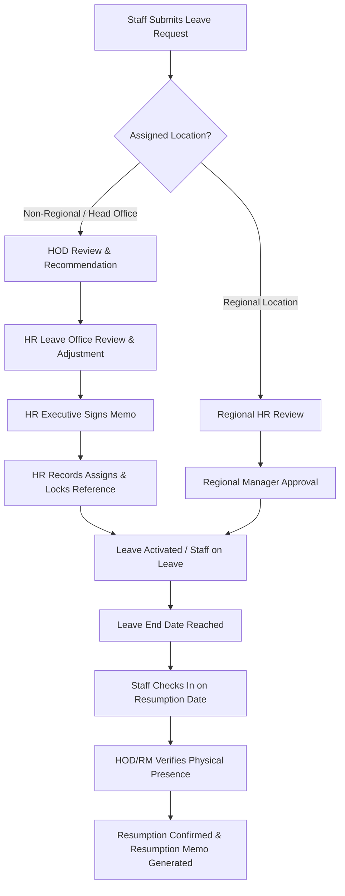
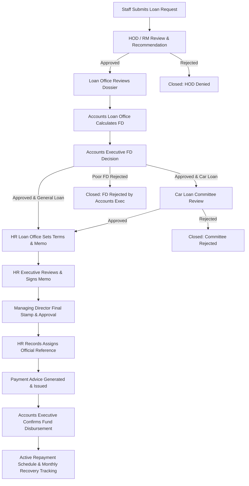

# 📘 Comprehensive System Workflow & User Training Manual
### Leave Management, Loan Administration, and Transport & Fleet Operations

---

## 📑 Table of Contents
1. [Introduction & Role-Based Navigation](#1-introduction--role-based-navigation)
2. [Module 1: Leave Management Workflow](#2-module-1-leave-management-workflow)
   - [2.1 End-to-End Lifecycle & Stages](#21-end-to-end-lifecycle--stages)
   - [2.2 Step-by-Step Roles Guide (Start to Finish)](#22-step-by-step-roles-guide-start-to-finish)
   - [2.3 Special Sub-Workflows: Deferments, Recalls, and Resumptions](#23-special-sub-workflows-deferments-recalls-and-resumptions)
   - [2.4 Leave Management DOs & DON'Ts](#24-leave-management-dos--donts)
3. [Module 2: Loan Administration Workflow](#3-module-2-loan-administration-workflow)
   - [3.1 End-to-End Lifecycle & Multi-Stage Gateways](#31-end-to-end-lifecycle--multi-stage-gateways)
   - [3.2 Step-by-Step Roles Guide (Start to Finish)](#32-step-by-step-roles-guide-start-to-finish)
   - [3.3 FD Calculation, Executive Review, and Rejection Rules](#33-fd-calculation-executive-review-and-rejection-rules)
   - [3.4 Disbursement, Confirmation & Repayment Tracking](#34-disbursement-confirmation--repayment-tracking)
   - [3.5 Loan Administration DOs & DON'Ts](#35-loan-administration-dos--donts)
4. [Module 3: Transport & Fleet Management Workflow](#4-module-3-transport--fleet-management-workflow)
   - [4.1 Non-Regional Requisitions (Head Office, Stores, Archives)](#41-non-regional-requisitions-head-office-stores-archives)
   - [4.2 Regional Transport Operations (Regions & Districts)](#42-regional-transport-operations-regions--districts)
   - [4.3 Vehicle Inventory, Booking, Shifts, and Dispatch](#43-vehicle-inventory-booking-shifts-and-dispatch)
   - [4.4 Transport & Fleet DOs & DON'Ts](#44-transport--fleet-dos--donts)
5. [Summary Reference Matrix](#5-summary-reference-matrix)

---

## 1. Introduction & Role-Based Navigation

The application connects all branches, regional directorates, and head office departments into an integrated system. Workflows are role-based and adhere strictly to organizational hierarchies, audit trails, and financial compliance controls.

### 🔑 Primary Roles Across Modules:
- **Staff Member**: Requesters for Leave, Loans, and Non-Regional Transport.
- **Head of Department (HOD) / Department Head**: First-line administrative approver for departmental staff requests.
- **Regional Manager (RM)**: Regional authority endorsing regional leave, loans, and transport trips.
- **HR Leave Office (`hr_leave_office`)**: Coordinates annual leave calendars, adjustments, deferments, and recalls.
- **HR Loan Office (`hr_loan_office` / `loan_office`)**: Prepares loan terms, recovery schedules, and verification dossiers.
- **Accounts Loan Office (`accounts` / `accounts_loan_office`)**: Calculates Financial Standing (FD) ratios from payroll data.
- **Accounts Executive (`accounts_executive`)**: Sole financial executive authority for approving or rejecting FD standings and confirming fund disbursements.
- **HR Executive / Director HR (`hr_executive`, `director_hr`)**: Signs official leave memos, loan authorization letters, and executive approvals.
- **HR Records (`hr_records`)**: Assigns immutable official memo references, locks them, and maintains archives.
- **Managing Director (MD)**: Final signatory for financial advances, MD approval stamps, and regional transport trips.
- **Transport Manager / Chief Driver (`transport_manager`, `chief_driver`)**: Fleet administrators responsible for vehicle allocation, shift assignments, and trip dispatch.
- **Driver (`driver`, `regional_driver`)**: Executes allocated journeys, updates live odometer readings, and marks trip completion.

---

## 2. Module 1: Leave Management Workflow



### 2.1 End-to-End Lifecycle & Stages
1. **Submission (`pending_hod` / `pending_regional_hr`)**: Staff selects leave category (Annual, Casual, Sick, Maternity, Study, etc.) and preferred dates.
2. **First Review (`hod_approved` / `regional_hr_approved`)**: HOD or Regional HR validates staffing coverage and recommends/rejects.
3. **HR Leave Office Processing (`pending_hr_leave_processing`)**: Leave Office validates leave balance entitlement, sets adjusted dates, and attaches traveling days if applicable.
4. **Executive Approval (`hr_office_forwarded` → `hr_approved`)**: HR Executive reviews the draft memo, signs digitally, and approves.
5. **Records Referencing (`pending_hr_records_reference` → `referenced`)**: HR Records assigns the official memo reference (e.g., `QCC/HRD/AL/2026/042`) and permanently locks it.
6. **Active Leave Period (`active` / `on_leave`)**: Staff is marked on active leave; attendance check-in is paused.
7. **Resumption Tracking & Check-In**: On the return date, staff checks in via the app.
8. **Supervisor Verification**: HOD/RM receives a verification prompt on their *All Requests* queue to verify physical resumption.

### 2.2 Step-by-Step Roles Guide (Start to Finish)

#### 🧑‍💼 For Regular Staff:
- **Where to Start**: Navigation Sidebar → **Leave Administration** → **Leave Management** → **Leave Center / Planning Tab**.
- **Action**: Choose leave type, select start/end dates, state reason, and click **Submit Request**.
- **On Return Date**: Open Attendance Check and complete check-in. The system automatically detects your return and logs your resumption claim.
- **Where to End**: Once your HOD confirms your return, your return-to-work confirmation memo is available under **My Requests / Memos**.

#### 👔 For Head of Department (HOD) / Regional Manager (RM):
- **Where to Start**: Sidebar → **Leave Administration** → **Pending Approval / HOD Review**.
- **Action**: Review leave requests submitted by staff under your supervision. Review team coverage before clicking **Approve** or **Reject**.
- **Resumption Verification**: Under **Leave Administration** → **All Requests**, look for staff rows highlighted in amber/red indicating ended leaves. Click **Verify Resumption** and select **Confirmed** or **Not Resumed**.

#### 📋 For HR Leave Office:
- **Where to Start**: Sidebar → **Leave Administration** → **Processing Requests** & **Outstanding Leave**.
- **Action**: Check staff balances, adjust dates for public holidays, assign deferments/recalls to HR Executives, and monitor 5-day resumption countdowns.

#### 🖋️ For HR Executive / Director HR:
- **Where to Start**: Sidebar → **Leave Administration** → **Memo Management / Executive Queue**.
- **Action**: Review pending leave memos, inspect terms, draw or apply your registered signature, and click **Approve & Sign Memo**.

#### 🗄️ For HR Records:
- **Where to Start**: Sidebar → **HR Records Management**.
- **Action**: Open **Pending References**, enter the official institutional filing reference, and click **Save & Lock Reference**.

---

### 2.3 Special Sub-Workflows: Deferments, Recalls, and Resumptions

#### A. Leave Deferment Workflow (Moving Leave to a Future Year):
1. **Staff** submits a Deferment Request from **Leave Management** → **Deferments Tab**.
2. **HOD** reviews and endorses the deferment reason.
3. **HR Leave Office** reviews the request under **Processing Requests** and assigns it to an HR Executive.
4. **HR Executive** reviews in **Memo Management**, signs, and approves the formal deferment letter.
5. Unused days are credited to the staff member's deferred balance for the specified target year.

#### B. Staff Recall Workflow (Emergency Return to Duty):
1. **HOD** initiates a Recall Request specifying the recall date and operational justification.
2. **HR Leave Office** validates the recall in **Processing Requests** and forwards to an HR Executive.
3. **HR Executive** signs the official Recall Memo.
4. The remaining unused leave days are automatically restored to the staff member's leave balance.

#### C. Resumption Notice & Non-Resumption Escalation:
- **T-5 to T-1 Days**: Staff and supervisors receive countdown notifications and audio-visual alerts.
- **Day 0 (Resumption Date)**: Staff checks in; HOD receives immediate in-app notice (`leave_resumption_needs_hod_verification`).
- **Day 2 (Overdue)**: Automatic 2-day warning banner appears on staff dashboard and supervisor queue.
- **Day 5 (Urgent Red)**: 5-day formal warning letter generated; HR Leave Office gains manual override verification access.
- **Day 10 (Critical Escalation)**: Check-in is blocked; query memo is dispatched for disciplinary investigation.

---

### 2.4 Leave Management DOs & DON'Ts

| Category | ✅ DO's | ❌ DON'Ts |
| :--- | :--- | :--- |
| **Staff** | • Submit leave applications at least 2 weeks in advance.<br>• Check in on your exact resumption date.<br>• Upload medical certificates promptly for sick leave. | • Do not leave station before HOD and HR approvals are granted.<br>• Do not resume work without checking in on the attendance system.<br>• Do not submit duplicate leave requests for the same date range. |
| **HOD / RM** | • Verify actual presence at the desk before clicking **Confirmed**.<br>• Provide meaningful reasons when adjusting dates or rejecting.<br>• Act on pending requests within 48 hours to prevent delays. | • Do not confirm resumption for staff who have not reported physically.<br>• Do not approve leave without checking department duty roster.<br>• Do not ignore amber/red overdue resumption notices. |
| **HR Leave Office** | • Cross-check public holidays when reviewing adjusted end dates.<br>• Monitor 5-day resumption countdowns daily.<br>• Assign deferments and recalls promptly to HR Executives. | • Do not modify leave balances without audit trail logging.<br>• Do not bypass HOD recommendation stages on non-regional requests. |
| **HR Executive** | • Verify official memo details and dates before applying signature.<br>• Ensure your digital signature is registered in the signature registry. | • Do not sign blank or incomplete memo templates.<br>• Do not approve requests that lack required attachments. |

---

## 3. Loan Administration Workflow



### 3.1 End-to-End Lifecycle & Multi-Stage Gateways
1. **Application (`pending_hod`)**: Staff selects loan type (Salary Advance, Car Loan, Building/Housing, Furniture, Funeral, Insurance, Vehicle Repair).
2. **HOD Recommendation (`hod_approved`)**: Supervisor confirms staff standing, rank, and work performance.
3. **Loan Office Processing (`sent_to_accounts`)**: Loan Officer reviews requirements and forwards to Accounts for FD check.
4. **Accounts FD Calculation (`pending_accounts_fd_review`)**: Accounts Loan Office inputs payroll figures (Gross salary, monthly deductions, existing loans) into the automated FD calculation sheet.
5. **Accounts Executive Decision (`fd_approved` / `fd_rejected`)**: Accounts Executive audits calculations and makes the sole approve/reject decision.
6. **Committee Review (`awaiting_committee`)**: Required exclusively for Car Loans.
7. **HR Terms Setup (`awaiting_hr_terms` → `awaiting_director_hr`)**: HR Loan Office specifies disbursement date, recovery start month, duration (1–36 months), and drafts the approval memo.
8. **HR Executive Signing (`awaiting_director_hr` / `awaiting_md`)**: HR Executive signs the loan terms memo.
9. **MD Final Stamp (`md_final_approved` / `approved_director`)**: Managing Director applies official approval.
10. **Referencing & Payment Advice (`referenced` / `payment_advice_ready`)**: HR Records records institutional reference; Payment Advice is prepared.
11. **Disbursement Sign-Off (`staff_receiving_funds` → `partially_recovered`)**: Accounts Executive verifies bank payment execution and confirms disbursement in the app.
12. **Repayment Recovery (`partially_recovered` → `payment_completed`)**: Monthly deductions tracked until balance reaches GH₵ 0.00.

---

### 3.2 Step-by-Step Roles Guide (Start to Finish)

#### 🧑‍💼 For Staff Requester:
- **Where to Start**: Navigation Sidebar → **Loan Administration** → **Apply for Loan**.
- **Action**: Select loan category, enter requested amount, specify repayment duration, upload supporting document (if funeral/insurance), and submit.
- **Where to Track**: **Loan Administration** → **My Loans** tab shows live timeline and stage badges.
- **Where to End**: Once approved by MD and referenced, download your signed Loan Authorization Memo from **My Loans**.

#### 👔 For HOD / Regional Manager:
- **Where to Start**: Sidebar → **Loan Administration** → **HOD Review / Pending Decisions**.
- **Action**: Review the applicant's eligibility. Click **Review & Decide** → select **Approve** or **Reject** with comments.

#### 🧮 For Accounts Loan Office:
- **Where to Start**: Sidebar → **Loan Administration** → **Accounts Queue / FD Calculator**.
- **Action**: Open the loan request, enter Annual Salary, Allowances, Gross Deductions, and Outstanding Loan Balances. Click **Calculate FD Score** and then **Submit FD to Accounts Executive**.
- *Note*: Accounts Loan Office cannot approve or reject loans.

#### 💼 For Accounts Executive:
- **Where to Start**: Sidebar → **Loan Administration** → **FD Verification Queue** and **Disbursement Confirmation**.
- **Action 1 (FD Approval/Rejection)**: Review calculated FD percentage. If score $\ge 39\%$ (or if exempt type like Funeral/Insurance/Repair), verify findings and click **Approve**. If score $< 39\%$ on non-exempt loans, click **Auto-Reject Poor FD** or enter rejection reasons.
- **Action 2 (Disbursement Confirmation)**: Under **Disbursement Confirmation**, when funds are disbursed by finance, click **Confirm Received** to activate the repayment schedule.

#### 📝 For HR Loan Office:
- **Where to Start**: Sidebar → **Loan Administration** → **HR Terms Queue**.
- **Action**: Enter Disbursement Date, Recovery Start Date, and Recovery Duration (1–3 months for Salary Advance, up to 36 months for long-term). Click **Forward to HR Executive**.

#### 🖋️ For HR Executive & Managing Director:
- **Where to Start**: Sidebar → **Loan Administration** → **Executive HR** / **MD Approvals**.
- **Action**: Inspect loan memo details and terms, apply signature/stamp, and click **Approve & Finalize**.

---

### 3.3 FD Calculation, Executive Review, and Rejection Rules

1. **The FD Formula**:
   $$\text{FD Ratio (\%)} = \frac{\text{Net Monthly Salary}}{\text{Gross Monthly Salary}} \times 100$$
   $$\text{Net Monthly Salary} = \text{Gross Monthly Salary} - (\text{Gross Deductions} + \text{New Loan Installment} + \text{Outstanding Burden})$$

2. **The 39% Threshold Rule**:
   - **Good Standing ($\ge 39\%$)**: Net salary exceeds half gross after all deductions. Cleared for approval.
   - **Poor Standing ($< 39\%$)**: Net salary is less than required threshold. Subject to rejection by Accounts Executive.

3. **FD-Exempt Loan Types (Never Auto-Rejected for FD)**:
   - **Funeral Relief Loans**
   - **Insurance Premium Loans**
   - **Vehicle / Equipment Repair Loans**
   - *These remain reviewable and approvable even with low FD scores due to welfare and operational necessity.*

4. **Rejection Authority Boundaries**:
   - **Accounts Loan Office**: 🚫 **CANNOT reject**. Can only forward calculated FD to Accounts Executive.
   - **Accounts Executive**: ✅ **Sole financial authority** to approve or reject FD submissions.
   - **Other Roles (HR, Loan Office, HOD)**: 👁️ Have **read-only** view access to FD scores and disbursement confirmations.

---

### 3.4 Disbursement, Confirmation & Repayment Tracking

```
MD Approval Applied
        ↓
Payment Advice Generated by HR Loan Office
        ↓
Bank / Accounts Disburses Funds to Staff
        ↓
Accounts Executive clicks [Confirm Received]
        ↓
Loan Status moves to 'partially_recovered'
        ↓
Repayment Tracking Panel Tracks Monthly Deductions
        ↓
Loan Balance reaches GH₵ 0.00 → 'payment_completed'
```

---

### 3.5 Loan Administration DOs & DON'Ts

| Category | ✅ DO's | ❌ DON'Ts |
| :--- | :--- | :--- |
| **Staff** | • Confirm your salary numbers match current payslip before applying.<br>• Provide mandatory proof documents for funeral/insurance loans.<br>• Check repayment schedule in **My Loans** after disbursement. | • Do not apply for non-emergency loans while on active leave.<br>• Do not request recovery periods exceeding policy limits (max 3 months for Salary Advance). |
| **Accounts Loan Office** | • Ensure all existing loan balances across all banks are captured in the calculator.<br>• Use the live calculation preview to verify net-to-gross percentages. | • Do not attempt to reject loan requests at the Accounts Loan Office stage.<br>• Do not enter arbitrary override figures without documentation. |
| **Accounts Executive** | • Audit calculation breakdown and verify salary slips before decision.<br>• Provide a clear note whenever adjusting a verified FD score.<br>• Confirm disbursements only after bank transfer proof is verified. | • Do not reject FD-exempt loan categories (Funeral, Insurance, Repair) for low FD scores.<br>• Do not reject loans with FD scores $\ge 39\%$ unless documentation is invalid. |
| **HR Loan Office** | • Ensure recovery start date follows disbursement date logically.<br>• Cross-check that the staff member is not already at max deduction limit. | • Do not set recovery terms before Accounts Executive has approved the FD score.<br>• Do not alter approved loan amounts without MD re-authorization. |

---

## 4. Module 3: Transport & Fleet Management Workflow

```mermaid
flowchart TD
    subgraph Non-Regional ["Pipeline A: Non-Regional / Head Office Trips"]
        A1[Staff / HOD Submits Non-Regional Trip] --> A2[HOD Endorsement & Recommendation]
        A2 --> A3[Transport Manager Assigns Vehicle & Driver]
        A3 --> A4[Driver Starts Trip & Logs Odometer]
        A4 --> A5[Trip Completed & Signed Off]
    end

    subgraph Regional ["Pipeline B: Regional Operations"]
        B1[Regional Staff / HR Submits Requisition] --> B2[Regional Manager Endorsement]
        B2 --> B3[Managing Director Approval]
        B3 --> B4[HR Executive Signs Transport Memo]
        B4 --> B5[HR Records Assigns & Locks Reference]
        B5 --> B6[Chief Driver / Transport Manager Allocates Vehicle & Driver]
        B6 --> B7[Driver Executes Journey & Closes Trip]
    end
```



### 4.1 Non-Regional Requisitions (Head Office, Stores, Archives)
- **Scope**: Head Office Swanzy Arcade, Awutu Stores, Nsawam Archives Center.
- **Workflow Steps**:
  1. **Requisition**: Staff/Officer creates trip requisition stating Origin, Destination, Purpose, Passengers, and Departure Date/Time.
  2. **HOD Endorsement**: Department Head approves the operational necessity.
  3. **Fleet Assignment**: Transport Manager assigns available roadworthy vehicle and driver.
  4. **Trip Execution**: Driver receives trip details on mobile, starts trip, inputs start mileage, and closes with end mileage upon return.

---

### 4.2 Regional Transport Operations (Regions & Districts)
- **Scope**: Ashanti, Western, Eastern, Central, Volta, Northern, Upper East, Upper West, Bono regions.
- **Workflow Steps**:
  1. **Regional Submission**: Regional HR / Officer files official transport requisition.
  2. **Regional Manager Endorsement**: RM verifies and endorses regional travel.
  3. **MD Approval & HR Executive Sign**: Managing Director approves; HR Executive signs the transport clearance memo.
  4. **HR Records Reference**: Official transport reference assigned.
  5. **Chief Driver Dispatch**: Regional Chief Driver selects vehicle and driver from local fleet.
  6. **Completion**: Driver completes assigned run and submits trip report.

---

### 4.3 Vehicle Inventory, Booking, Shifts, and Dispatch
- **Vehicle Inventory (`/dashboard/transport/inventory`)**: Displays vehicle registration, model, fuel type, status (Available, On Trip, In Maintenance, Grounded), and roadworthiness expiry.
- **Shift Scheduling (`/dashboard/transport/shifts`)**: Schedules driver duty rosters, morning/afternoon shifts, and shift swap requests.
- **Live Fleet Tracking**: Transport Manager monitors active trips, driver assignments, and vehicle availability in real time.

---

### 4.4 Transport & Fleet DOs & DON'Ts

| Category | ✅ DO's | ❌ DON'Ts |
| :--- | :--- | :--- |
| **Requesters** | • Submit transport requisitions at least 48 hours before planned departure.<br>• List all official passengers and cargo details accurately. | • Do not request official transport for unauthorized private trips.<br>• Do not alter destination without prior HOD/Transport Manager approval. |
| **HOD / RM** | • Verify official purpose and route urgency before endorsing.<br>• Combine trip requests where multiple officers are travelling to the same destination. | • Do not endorse trips with unspecified or vague destinations.<br>• Do not approve requisitions if alternative pooled transport exists. |
| **Transport Manager / Chief Driver** | • Check vehicle service records, insurance, and roadworthiness before dispatch.<br>• Rotate drivers fairly and ensure rest compliance between long journeys.<br>• Record maintenance requests immediately. | • Do not dispatch vehicles marked as "In Maintenance" or "Grounded".<br>• Do not assign drivers who are off-duty or on leave. |
| **Drivers** | • Inspect oil, coolant, tyres, and brakes before starting trip.<br>• Log start and end odometer readings accurately in the mobile app.<br>• Report vehicle faults or delays promptly to Chief Driver. | • Do not embark on unassigned or unreferenced journeys.<br>• Do not allow unauthorized persons to operate official QCC vehicles. |

---

## 5. Summary Reference Matrix

| Feature / Step | Leave Management | Loan Administration | Transport & Fleet |
| :--- | :--- | :--- | :--- |
| **Where Staff Applies** | Leave Management → Leave Center | Loan Administration → Apply for Loan | Transport → New Requisition |
| **First Reviewer** | Head of Department (HOD) / RM | Head of Department (HOD) / RM | HOD (Non-regional) / RM (Regional) |
| **Middle Stage / Calculations** | HR Leave Office (Entitlements & Dates) | Accounts (FD Ratio Calculation) | Transport Manager (Vehicle & Driver) |
| **Financial / Welfare Gate** | Balance & Coverage Check | Accounts Executive (Approve/Reject FD) | Fuel & Route Clearance |
| **Executive Sign-off** | HR Executive / Director HR | HR Executive & Managing Director | Managing Director & HR Executive |
| **Official Filing Code** | HR Records (`memo_reference`) | HR Records (`reference_number`) | HR Records (`memo_reference`) |
| **Execution / Confirmation** | Resumption Check-in & HOD Verification | Accounts Executive (Confirm Received) | Driver Odometer & Trip Completion |
| **Terminal Status** | `completed` (after return verified) | `payment_completed` (zero balance) | `completed` / `closed` |

---
*Document Version: 2.5 (September 2026)*  
*Quality Control Company Limited (COCOBOD)*
